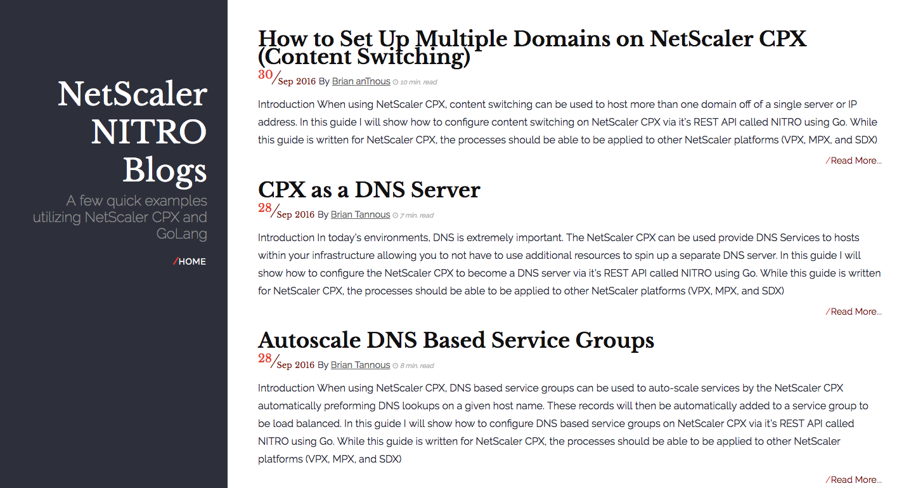

# Building the latest image 

You do not have to build the image locally if you do not desire to. You can pull directly from docker hub by enter the `docker run` command in later sections or by issuing a `docker pull` command shown below: 

`docker pull mayankt-cpx-blog`

**Option 1:**
Assuming that Brian's site [`bt.logix.bz`](http://bt.logic.bz/) is still hosted on the Internet, you can run the following `docker build` command to create an updated portable docker image locally with the latest posts and content: 

`git clone https://github.com/Citrix-TechSpecialist/GoLang-cpx.git`
`docker build -t mayankt/cpx-blog ./GoLang-cpx`

**Option 2:**
If the site is no longer hosted by Brian, you can still create the blog from a locally saved copy by running the following commands: 

`git clone https://github.com/Citrix-TechSpecialist/GoLang-cpx.git`
`docker build -f Dockerfile-latest -t mayankt/cpx-blog ./GoLang-cpx`

# Run the Blog Locally

Enter the following command on your docker host: 

`sudo docker run -dt --name=cpx-blog -p 8080:80 mayankt/cpx-blog`

# Viewing the Blog 

Navigate to `http://localhost:8080` to view the content. 

Replace `localhost` with your dockerhost IP if deployed on a remote server. Below is a preview of the content: 

# Destroying the Blog 

Run the following command on the dockerhost: 

`sudo docker rm -f cpx-blog`